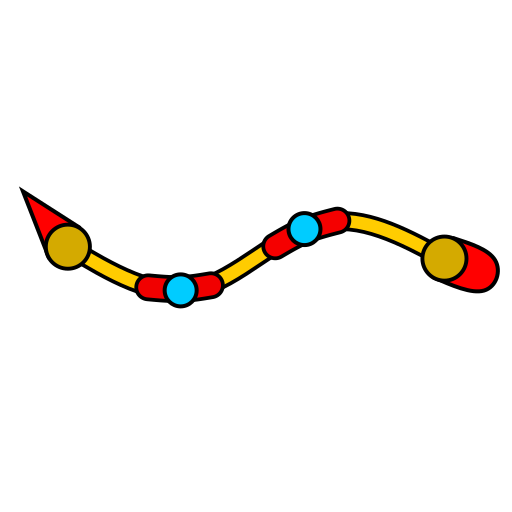
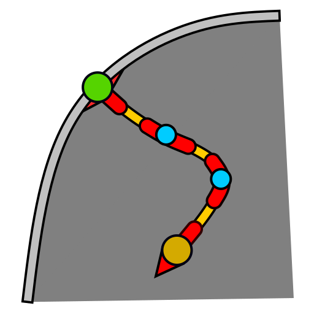
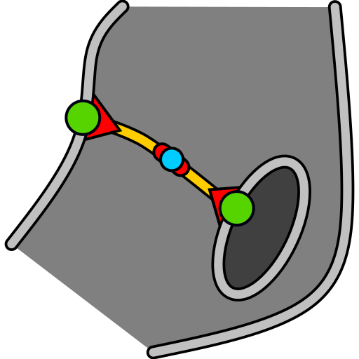
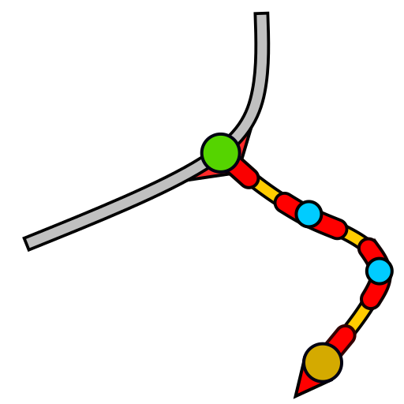
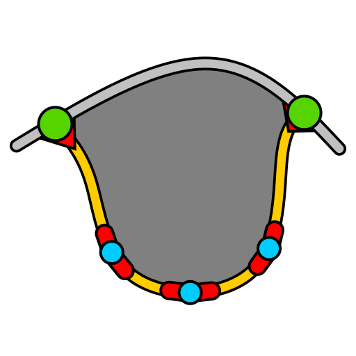
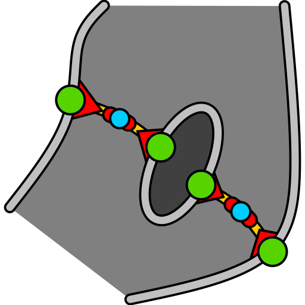

# Types

## Shapes and Lines

Shapes and lines are the largest unit of drawable. Shapes are Lines that connect to themselves, forming a circle, and which hence can contain an inside.

The following types are available:

### Isolate



```python
@dataclass
class Isolate(Line):
	startPoint: StyledEndPoint
	endPoint: StyledEndPoint
	path: Path = None
```

An `Isolate` is a `Line` which ain't connected to anything, connecting its `startPoint` to its `endPoint`.

```python
	startPoint: StyledEndPoint
```
The start point of the `Isolate`. Can be positioned in the canvas or relative to the area of another shape. Contains endpoint styling.

```python
	endPoint: StyledEndPoint
```
The end point of the `Isolate`. Can be positioned in the canvas or relative to the area of another shape. Contains endpoint styling.

```python
	path: Path = None
```
The path between the start point and the end point of the `Isolate`


### Shape


```python
@dataclass
class Shape(Line):
	centerPoint: Position
	path: Path = None
```
An `Shape` is a `Line` which ain't connected to anything, but whose path forms a circle

```python
	centerPoint: Position
```
The center point of the `Shape`. Can be positioned in the canvas or relative to the area of another shape.

```python
	path: Path = None
```
The path of the `Shape`. This goes around, it's last point is it's first at the same time


### Inwards



```python
@dataclass
class Inwards(Line):
```
An `Inwards` is a `Line` that starts on a `Cut` of the `Path` of an `Shape`, and which goes inwards from it until it reach its own `endPoint`

```python
	origin: Shape
	startPoint: StyledCut
	endPoint: StyledEndPoint
	path: Path = None
```
The shape the Inwards leads back to


```python
	startPoint: StyledCut
```
The start point of the `Inwards`. Is a `Cut` on the `Path` from:
- The `Shape` itself.
- Another `Inwards` leading back to the `Shape`
- A `Split` leading back to the `Shape` 

Contains cut styling.

```python
	endPoint: StyledEndPoint
```
The end point of the `Inwards`. Can be positioned in the canvas or relative to the area of another shape. Contains endpoint styling.

```python
	path: Path = None
```
The path between the start point and the end point of the `Inwards`


### Bridge



```python
@dataclass
class Bridge(Inwards):
```
A `Bridge` is a `Inwards` that ends in another `Shape`

```python
	origin: Shape
	startPoint: StyledCut
	child: Shape
	endPoint: StyledCut
	path: Path = None
```
The first shape the Inwards leads back to

```python
	startPoint: StyledCut
```
The start point of the `Bridge`. Is a `Cut` on the `Path` from:
- The `origin` `Shape` itself.
- Another `Inwards` leading back to the `origin` `Shape`
- A `Split` leading back to the `origin` `Shape` 

Contains cut styling.

```python
	child: Shape
```
The second shape the Inwards leads back to

```python
	endPoint: StyledCut
```
The end point of the `Inwards`. Is a `Cut` on the `Path` from:
- The `child` `Shape` itself.
- Another `Inwards` leading back to the `child` `Shape`
- A `Split` leading back to the `child` `Shape` 

Contains cut styling.

```python
	path: Path = None
```
The path between the start point and the end point of the `Inwards`


### Outwards



```python
@dataclass
class Outwards(Line):
	startPoint: StyledCut
	endPoint: StyledEndPoint
	path: Path = None
```
An `Outwards` is a `Line` that starts on a `Cut` of the `Path`, and which goes outwards from that `Path` from it until it reach its own `endPoint`


```python
	startPoint: StyledCut
```
The start point of the outwards line, as a `Cut` on any `Path`. Contains cut styling.

```python
	endPoint: StyledEndPoint
```
The end point of the `Outwards`. Can be positioned in the canvas or relative to the area of another shape. Contains endpoint styling.

```python
	path: Path = None
```
The path between the start point and the end point of the `Outwards`


### Tongue



```python
@dataclass
class Tongue(Shape):
```
A `Tongue` is a `Shape` that splits a `Path`, from a `Cut` on one of it's sub-`Path`s to another `Cut` of it's on one of it's sub-`Path`s.

```python
	origin: Line
	startPoint: StyledCut
	endPoint: StyledCut
	path: Path = None
```
The origin `Line` that this `Split`s

```python
	startPoint: StyledCut
```
The start point of the `Tongue`. Can be a `Cut` on the `Path` of:
- The origin `Line` itself
- One of the `Inwards` from the origin `Line`
- One of the `Split`'s from the origin `Line`, can be several layers deep.

Contains cut styling.

```python
	endPoint: StyledCut
```
The end point of the `Tongue`. Can be a `Cut` on the `Path` of:
- The origin `Line` itself
- One of the `Inwards` from the origin `Line`
- One of the `Split`'s from the origin `Line`, can be several layers deep.

Contains cut styling.

```python
	path: Path = None
```
The path between the start point and the end point of the `Tongue`


### Split


```python
@dataclass
class Split(Tongue):
	origin: Shape
	startPoint: StyledCut
	endPoint: StyledCut
	path: Path = None
```
A `Split` is a `Tongue` that splits a `Shape`, from a `Cut` on one of it's sub-`Path`s to another `Cut` of it's on one of it's sub-`Path`s.

```python
	origin: Shape
```
The origin `Shape` that this `Split`s

```python
	startPoint: StyledCut
```
The start point of the `Split`. Can be a `Cut` on the `Path` of:
- The origin `Shape` itself
- One of the `Inwards` from the origin `Shape`
- One of the `Split`'s from the origin `Shape`, can be several layers deep.

Contains cut styling.

```python
	endPoint: StyledCut
```
The end point of the `Split`. Can be a `Cut` on the `Path` of:
- The origin `Shape` itself
- One of the `Inwards` from the origin `Shape`
- One of the `Split`'s from the origin `Shape`, can be several layers deep.

Contains cut styling.

```python
	path: Path = None
```
The path between the start point and the end point of the `Split`


### BridgedSplit


```python
@dataclass
class BridgedSplit(Split):
	origin: Shape
	startPoint: StyledCut
	endPoint: StyledCut
	bridges: List[Bridge]
```
A `Split` that encloses a set of other `Shape`s using `Bridges`

```python
	origin: Shape
```
The origin `Shape` that this `Split`s

```python
	startPoint: StyledCut
```
The start point of the `Split`. Can be a `Cut` on the `Path` of:
- The origin `Shape` itself
- One of the `Inwards` from the origin `Shape`
- One of the `Split`'s from the origin `Shape`, can be several layers deep.

Contains cut styling.

```python
	endPoint: StyledCut
```
The end point of the `Split`. Can be a `Cut` on the `Path` of:
- The origin `Shape` itself
- One of the `Inwards` from the origin `Shape`
- One of the `Split`'s from the origin `Shape`, can be several layers deep.

Contains cut styling.


```python
	bridges: List[Bridge]
```
The set of bridges that this split connects. Each bridge needs to lead back to the preceding bridge in the list, and the `origin` of the first element in the list needs to be the `child` of the last element in the list
